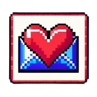

	

<h1 align="center">Loveletter</h1>

	<strong>Created in 1952, re-created in 2024!</strong>

## 🚀 Overview

The **Love Letters Generator** is a modern, visually appealing web application that pays homage to Christopher Strachey's "Loveletters" program from 1952. It generates random love letters using a predefined set of words and phrases, recreating the charm and sentimentality of the original.

## 🎨 Features

- **Dark Themed and Modern Design**: A sleek, dark-themed interface that enhances user experience.
- **Random Love Letters**: Generate unique love letters with a click of a button.
- **Historical Context**: Learn about the significance of Christopher Strachey's program and its connection to Alan Turing.

## 📈 Usage

1. Open the [Love Letters Generator](./index.html) in a browser.
2. Click the **Generate New Love Letter** button to produce a new love letter.
3. Visit the **About** page to learn more about the historical context and significance of the original program.

## 📖 History

Christopher Strachey's "Loveletters" program, created in 1952, is recognized as the first work of electronic literature. Developed on the Manchester Mark I computer, it generated random love letters and was a groundbreaking intersection of technology and creativity. Strachey, a close collaborator of Alan Turing, was a pioneer in computer science. Their work is not only significant for its technical achievements but also for its subtextual critique of heteronormative expressions of love.

## 📜 License

[LICENSE](./LICENSE)